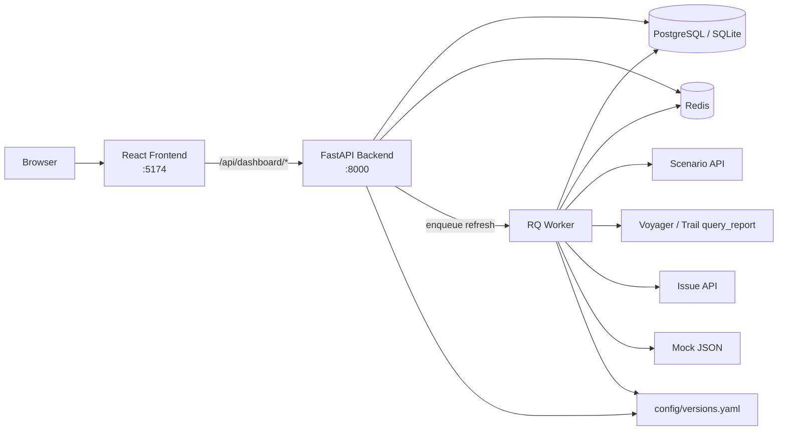
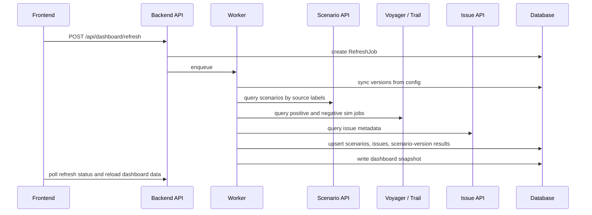

# RA Sim Repro Dashboard

RA stuck 自触发模型仿真复现看板。该应用是 `ra_sim_repro_dashboard/` 下的独立系统，和既有 `model_release_pipeline` 没有运行时依赖。

完整架构设计见 [ARCHITECTURE.md](ARCHITECTURE.md)。本文档作为项目 README，覆盖目标、系统边界、运行方式、真实数据接入、API 和排障入口。

## 1. 看板目标

看板用于把 release 版本的 source scenario 与仿真 job 结果对齐，回答三个问题：

- 当前版本的仿真复现率是多少。
- 各 release 自身全量场景的 Precision / Recall / Specificity / Accuracy 趋势是否合理。
- 每一个 issue / scenario 为什么是 TP、FP、FN、TN，以及它在不同版本上的仿真触发表现。

核心指标：

```text
precision = TP / (TP + FP)
recall    = TP / (TP + FN)
f1        = 2 * precision * recall / (precision + recall)

sim_repro_rate = sim-triggered source auto-trigger scenarios
               / source auto-trigger scenarios

source auto-trigger scenarios = positive_auto + negative_auto
positive_manual 的路测行为复现要求仿真不自动触发；业务 truth 中仍属于正样本。
```

## 2. 系统边界

本项目负责：

- 读取 `config/versions.yaml` 中配置的 release、binary、scenario labels、positive / negative sim jobs。
- 通过后端拉取 Scenario API、Voyager / Trail sim result API 和 issue metadata。
- 归一化每个 scenario 的 source GT 与仿真触发信号。
- 计算版本聚合指标和 scenario-version 明细。
- 提供 React 看板、版本筛选、趋势图、root cause 分布和 issue 明细面板。

本项目暂不负责：

- 复用或改造 `model_release_pipeline`。
- 前端直接访问内网 API 或保存 token。
- bag frame timeline 级解析。
- 自动创建仿真 job。当前版本只消费人工提供的 positive / negative job id。

## 3. 技术栈

| 层 | 技术 | 说明 |
| --- | --- | --- |
| Frontend | React, Vite, TypeScript | 单页看板，开发端口 `5174` |
| UI | Tailwind CSS, local shadcn-style components | Apple-like 蓝色风格，支持明暗模式 |
| Charts | Recharts | 折线图、柱状图、tooltip、数据标签 |
| Table | TanStack Table | issue / scenario 明细 |
| i18n | i18next, react-i18next | 中文 / 英文切换 |
| Backend | FastAPI, Pydantic, SQLAlchemy | API、刷新任务、数据归一化 |
| DB | PostgreSQL / SQLite | Docker 默认 PostgreSQL，本地可用 SQLite |
| Queue | Redis, RQ | 异步刷新与刷新锁 |
| Deployment | Docker Compose | frontend、backend、worker、postgres、redis |

## 4. 运行时架构



职责划分：

- Frontend: 展示、筛选、交互，不保存内部 API 凭据。
- Backend: 提供 REST API、创建刷新任务、读取快照和明细。
- Worker: 执行真实刷新，调用内部 API，计算指标，写数据库。
- PostgreSQL: 存储版本、scenario、issue、scenario-version result、dashboard snapshot、refresh job。
- Redis: RQ 队列和同配置刷新互斥锁。

## 5. 数据链路



数据优先级：

1. Full-release artifacts: `reports/ra_repro_full_20260829_manifest.csv` 提供 cohort/truth，
   `reports/ra_repro_full_20260829_metrics.json` 提供 scenario DPE 与质量门禁。
2. Mock JSON: `data/mock/sim_job_{job_id}.json` 和 `data/mock/issues.json`。
3. Voyager `query_report`: 依赖 `VOYAGER_COOKIE`。
4. Trail signed API: 依赖 `TRAIL_APP_ID` / `TRAIL_APP_TOKEN`。
5. Config fallback: 内部 API 不可用时使用 `source_gt_counts` / `sim_eval` 保证看板可启动。

## 6. 版本配置

版本配置在 [config/versions.yaml](config/versions.yaml)。当前配置 2026-06-05 至
2026-08-21 的 11 个 full-release job。每个版本使用单一 Orion job，并通过 manifest
中的 `cohort` 区分 `positive_auto`、`negative_auto` 和 `positive_manual`。

单版本结构示例：

```yaml
versions:
  "gen4-release-20260821":
    label: "release20260821"
    binary: "gen4-release-20260821"
    binary_id: 1775147
    sim_job_id: 45193683
    source_manifest: "ra_repro_full_20260829_manifest.csv"
    result_metrics: "ra_repro_full_20260829_metrics.json"
```

## 7. 仿真判定

full-release 三类场景的双重语义：

- 路测行为：`positive_auto`、`negative_auto` 预期触发，`positive_manual` 预期不触发。
- 业务 truth：`positive_auto`、`positive_manual` 为正，`negative_auto` 为负。

因此历史误触发复现率高不等于业务正确率高；看板同时展示三类行为复现率和
Precision / Recall / Specificity / Accuracy。

后端归一化字段为 `dpe_assist_channel_triggered`。`0` 和 `false` 是有效值，不能被 truthy fallback 覆盖。

## 8. 目录结构

```text
ra_sim_repro_dashboard/
  README.md
  ARCHITECTURE.md
  docker-compose.yml
  .env.example
  config/
    versions.yaml
    versions.example.yaml
  data/mock/
    issues.json
    sim_job_*.json
  backend/
    app/
      api/routes.py
      config.py
      database.py
      metrics.py
      models.py
      schemas.py
      worker.py
      services/
    tests/
  frontend/
    src/
      App.tsx
      api/client.ts
      components/
      i18n.ts
      types.ts
```

## 9. Backend API

| Method | Path | 用途 |
| --- | --- | --- |
| `GET` | `/api/health` | 健康检查 |
| `GET` | `/api/dashboard/versions` | 版本配置和元信息 |
| `GET` | `/api/dashboard/summary` | 当前版本 summary |
| `GET` | `/api/dashboard/version-comparison` | 版本趋势数据 |
| `GET` | `/api/dashboard/issues` | issue/scenario 明细分页 |
| `GET` | `/api/dashboard/issues/{issue_id}` | issue 详情 |
| `GET` | `/api/dashboard/scenarios/{scenario_id}` | scenario 跨版本结果 |
| `POST` | `/api/dashboard/refresh` | 创建刷新任务 |
| `GET` | `/api/dashboard/refresh/{job_id}` | 查询刷新任务 |
| `GET` | `/api/dashboard/root-causes` | 根因分布 |

## 10. 本地运行

Backend:

```bash
cd ra_sim_repro_dashboard/backend
python3 -m venv .venv
source .venv/bin/activate
pip install -r requirements.txt
uvicorn app.main:app --reload --port 8000
```

Frontend:

```bash
cd ra_sim_repro_dashboard/frontend
npm install
npm run dev
```

打开 `http://127.0.0.1:5174`，首次进入后点击刷新。默认配置会优先读取 `data/mock` 中的 mock 数据。

## 11. Docker Compose

```bash
cd ra_sim_repro_dashboard
docker compose up --build
```

服务端口：

- Frontend: `http://127.0.0.1:5174`
- Backend API: `http://127.0.0.1:8000`
- PostgreSQL host port: `5433`
- Redis host port: `6380`

## 12. 真实数据接入

复制环境变量模板：

```bash
cd ra_sim_repro_dashboard
cp .env.example .env
```

按需填写：

```bash
VOYAGER_RESULT_BASE_URL=https://voyager.intra.xiaojukeji.com
VOYAGER_COOKIE='copy Cookie header from Chrome DevTools'
VOYAGER_QUERY_PAGE_SIZE=1000

TRAIL_BASE_URL=http://100.69.238.11:8000/voyager/trail
TRAIL_APP_ID=...
TRAIL_APP_TOKEN=...

SCENARIO_APP_ID=...
SCENARIO_APP_TOKEN=...
ISSUE_APP_ID=...
ISSUE_APP_TOKEN=...
```

不要提交真实 cookie、token、个人登录态或 `.env`。

## 13. Binary 四版本滚动回测

滚动回测使用目标 release 的 binary/runtime，对包含目标版本在内的连续四个
release 场景进行分层抽样。三个 cohort 为 `positive_auto`、`negative_auto`、
`positive_manual`。其中 `negative_auto` 在路测中确实触发，但业务真值是误触发：
它在路测复现率中期望触发，在 Precision 中记作 FP。

硬门禁：

- Gen4 只使用 `prod_gen4`，单 Job、`max_concurrency=1`。
- `--simulator-cache=disabled`。
- 每个 task 都必须启用 DPE，并包含
  `--planning_enable_sim_assist_stuck_independent_replay`。
- 完成后要求 inference log、DPE output、critical output bag 非空，且无 cache hit、
  failed evaluation 或异常 warning。
- legacy full-release Job 即使 binary/cache 相同，只要缺 independent replay 或并发
  不符，就不能拼入新指标。

Dry-run 单批计划：

```bash
python3 scripts/run_with_voyager_env.py -- \
  .venv/bin/python scripts/ra_repro_launch_binary_backtest.py \
  --manifest reports/ra_repro_full_20260829_manifest.csv \
  --target-release gen4-release-20260821 \
  --source-release gen4-release-20260731 \
  --source-release gen4-release-20260807 \
  --source-release gen4-release-20260814 \
  --sample-per-cohort 10 --max-concurrency 1 \
  --selected-manifest reports/backtest_manifest.csv \
  --analysis-manifest reports/backtest_analysis_manifest.csv
```

`--execute` 才会创建 Orion Job。所有提交写入
`reports/ra_binary_backtest_20260831_jobs.json`，registry key 包含目标、来源、抽样
seed、manifest hash 和 replay 配置 hash，重复提交会被拒绝。

无人值守串行推进：

```bash
python3 scripts/run_with_voyager_env.py -- \
  .venv/bin/python scripts/ra_repro_run_binary_backtest_pipeline.py \
  --execute --cancel-on-anomaly --poll-seconds 300
```

`run_with_voyager_env.py` 将 Voyager `.vscode/voyager.env` 当作数据解析，只传递
Orion 客户端所需的 Python、动态库和 Voyager 路径；不要直接 `source` 该文件，
其中的 `LS_COLORS` 等值包含 shell 分隔符。若已在完整 Voyager 开发环境中，也可直接
运行后面的 `.venv/bin/python ...` 命令。

推进器每次只做一个状态转换：等待当前 Job、验证门禁、补缺失窗口、发布一个目标，
或因质量异常停止。最终 artifact 为
`reports/ra_binary_backtest_20260831_metrics.json`；更新后推进器会调用 Dashboard
refresh API，等待刷新成功再写 refresh stamp。Dashboard 暂时不可用时会记录
`dashboard_refresh_error` 并在后续轮询重试，但不会阻断后续 Orion 窗口；Orion
查询、提交或质量门禁异常仍按严格失败策略处理。

`--cancel-on-anomaly` 只处理已经出现 `FAILED`/`CANCELLED` task、同时仍有
`UNASSIGNED`/`RUNNING` task 的 Job。推进器先把异常状态写入 JSONL 审计日志，再取消
剩余工作并写入取消回执。活动 Job 每轮还会增量检查 binary、cluster、并发、cache、
DPE、independent replay、inference log 和关键输出；若已完成样本污染且仍有剩余任务，
同样先审计再取消。已全部完成的 Job 只会停止发布，不会执行无意义的取消操作。

## 14. 测试

Frontend:

```bash
cd ra_sim_repro_dashboard/frontend
npm run build
```

Backend:

```bash
cd ra_sim_repro_dashboard/backend
pytest tests
```

如果本机没有 Python 测试依赖，可以用 Docker 镜像运行后端测试：

```bash
docker compose -f ra_sim_repro_dashboard/docker-compose.yml run --rm --no-deps \
  -v /home/didi/workspace/ra_tools/ra_sim_repro_dashboard/backend/tests:/app/backend/tests:ro \
  backend pytest tests
```

## 15. 排障入口

页面无数据：

- 检查是否执行过 `POST /api/dashboard/refresh`。
- 检查 `GET /api/dashboard/summary` 是否返回 404。
- 检查 `config/versions.yaml` 是否包含 current version。
- 检查数据库是否已有 `scenario_version_results`。

真实 API 不可用：

- 检查内网是否可访问。
- 检查 `VOYAGER_COOKIE`、`TRAIL_APP_ID`、`TRAIL_APP_TOKEN`、`SCENARIO_APP_ID`、`SCENARIO_APP_TOKEN`。
- 检查后端日志中是否出现 fallback warning。
- 确认 `data/mock` 是否存在同 job id 的 mock 文件，mock 会优先覆盖真实 API。

指标和表格不一致：

- 确认 positive / negative job id 没有配反。
- 确认 scenario labels 和 release binary 对应。
- 对比 `source_gt.data_source` 是 `scenario_api` 还是 `config_fallback`。
- 对比 `sim_estimate.data_source` 是 `query_report` 还是 fallback。

## 16. 进一步文档

- [ARCHITECTURE.md](ARCHITECTURE.md): 完整架构、数据模型、刷新链路、前端模块和扩展计划。
- [config/versions.example.yaml](config/versions.example.yaml): 新版本配置模板。
- [docker-compose.yml](docker-compose.yml): 本地完整服务编排。
