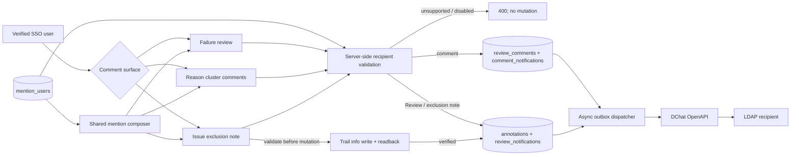

# DChat @mention architecture

`access_users` and `mention_users` deliberately answer different questions.
The former grants Dashboard writer/admin authority; the latter only permits a
username to appear in comment suggestions and receive a DChat notification.
Both are administered on `/users`, but membership in `mention_users` never
grants write access.

The browser fetches only enabled usernames for normal verified users. It is a
convenience layer, not the security boundary. Candidates stay hidden until the
caret is inside an `@` token; typing filters the directory incrementally,
keyboard arrows plus Enter/Tab select a result, and Escape dismisses the
popover without deleting the typed token. The popover is anchored to the
active token's `@` glyph rather than the textarea edge, so comments containing
multiple mentions follow the token under the caret. It opens above or below
according to the remaining viewport space and repositions while the textarea
or page scrolls. The current verified user remains a valid candidate and can
deliberately notify themself as a follow-up reminder.
The same comment-thread dialog is available from reason-analysis rows and
Review exclusion candidate rows. Each entry carries its model Run binding, so
the authoritative thread key is `issue_id + model_run_id`. Comments are
append-only rows in `review_comments`; they do not append an annotation and
cannot change the Review conclusion, tags, evidence, or exclusion flag.

A reply stores `reply_to_id` and renders the parent author/excerpt. The browser
prefills `@parent`, while the server independently adds the enabled parent
author to the effective DChat recipient set. This makes reverse notification
reliable even if a client omits the visible token. Every submitted comment is
parsed again by the server, limited to ten explicit mentions, and rejected if
an explicitly mentioned recipient is absent or disabled. Comment and
`comment_notifications` outbox rows commit in one database transaction. DChat
delivery is asynchronous, so a temporary DChat failure cannot roll back a
saved comment or Review.

DChat comment messages link to `/review?issue=...&run=...&comments=1&comment=...`.
After the Issue and Run load, the Dashboard automatically opens the shared
thread and focuses the notified comment. The same thread entry is available in
failure review, reason analysis, and Review exclusion candidates. LDAP remains
the authoritative token stored in comment text; the directory's `display_name`
is used in suggestions, rendered comments, reply context, and DChat copy.

For direct Issue exclusion, all comments are validated before the first Trail
write. Only after Trail reports a complete successful readback does the server
append the local Review exclusion version and its notification outbox rows.
Preview operations never notify.
