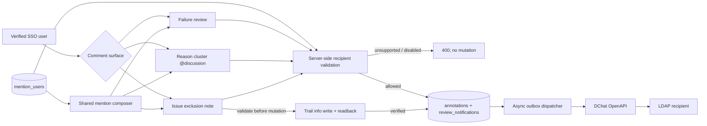

# DChat @mention architecture

`access_users` and `mention_users` deliberately answer different questions.
The former grants Dashboard writer/admin authority; the latter only permits a
username to appear in comment suggestions and receive a DChat notification.
Both are administered on `/users`, but membership in `mention_users` never
grants write access.

The browser fetches only enabled usernames for normal verified users. It is a
convenience layer, not the security boundary. Candidates stay hidden until the
caret is inside an `@` token; typing filters the directory incrementally,
keyboard arrows plus Enter/Tab select a result, and Escape dismisses the
popover without deleting the typed token. The current verified user remains a
valid candidate and can deliberately notify themself as a follow-up reminder.
Every submitted comment is parsed again by the server, limited to ten unique
recipients, and rejected if any recipient is absent or disabled. Annotation and
outbox rows commit in one database transaction. DChat delivery is asynchronous,
so a temporary DChat failure cannot roll back a saved Review.

For direct Issue exclusion, all comments are validated before the first Trail
write. Only after Trail reports a complete successful readback does the server
append the local Review exclusion version and its notification outbox rows.
Preview operations never notify.
